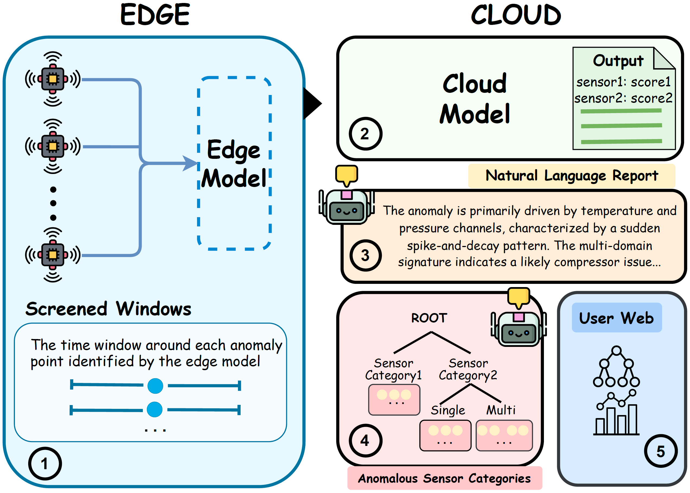

# ECLAD
This is the official code for the paper [ECLAD: An Edge-Cloud Collaborative Agentic Framework for Interpretable Anomaly Detection in Predictive Maintenance](https://youtu.be/48oUWHXyjHE).

The demo video is available here: [https://youtu.be/48oUWHXyjHE](https://youtu.be/48oUWHXyjHE).



## Getting Started with Create React App

This project was bootstrapped with [Create React App](https://github.com/facebook/create-react-app).

### Available Scripts

In the project directory, you can use:

```shell
npm install
npm start
```

to run the app in the development mode.\
Open [http://localhost:3000](http://localhost:3000) to view it in your browser.

The page will reload when you make changes.\
You may also see any lint errors in the console.